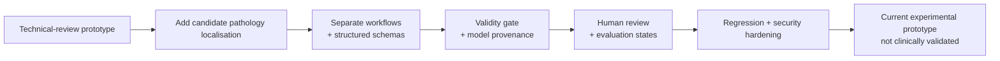

# PeriApicaI (v2.9.1)

> **Experimental AI-assisted prototype for periapical radiograph review**

PeriApicaI supports two independent workflows: **Technical Quality Assessment** and **candidate pathology localisation**. It uses multimodal Gemini single/dual-model inference, structured outputs, provenance tracking, synthesized consensus, and human review.

## Scope

**Research and education prototype only.** PeriApicaI has not been clinically validated and is not a certified medical device. AI-generated findings, overlays, confidence values, and reference guidance require independent professional interpretation and must not replace diagnosis, treatment planning, or clinical judgment.

## Key capabilities

- **Technical Quality Assessment:** reviews 11 canonical acquisition-error classes covering receptor placement, angulation/geometry, and exposure/processing.
- **Candidate pathology localisation:** generates supported finding/restorative classes with polygon overlays; reviewers can edit or add annotations.
- **Pre-analysis validity gate:** checks whether the image is suitable for the requested workflow and whether the selected tooth is plausible.
- **Single/dual-model inference:** records model provenance and can synthesize a consensus result in dual mode.
- **Human review & audit:** stores review states, assessment lineage, and admin audit/export records.
- **Bilingual responsive UI:** Vietnamese/English, desktop/tablet/mobile, light/dark themes.

## Development story



This diagram summarizes documented design evolution, not clinical validation. Detailed release history remains in [version_logs.md](version_logs.md); the operational flow below describes how the current application is used.

## Prototype workflow

1. Select radiographic technique, receptor type, and target tooth.
2. Upload a periapical radiograph and run the validity pre-flight.
3. Run either Technical Quality Assessment or candidate pathology localisation.
4. Review, edit, or add findings; inspect provenance and educational reference guidance.
5. Save the reviewed assessment record or export audit data where supported.

## Supported finding groups

**Technical quality:** receptor placement, angulation/geometry, and exposure/processing errors.

**Candidate pathology/restorative localisation:** periapical radiolucency, alveolar bone loss, enamel/dentin radiolucency, crown/filling restorations, root-canal filling, and dental implant.

## Technology

- **Frontend:** React 19, TypeScript, Tailwind CSS v4, i18next
- **Backend:** Express, Node.js, Google Gen AI SDK
- **Persistence:** Firebase Admin / Firestore with local fallback
- **Build & tests:** Vite, esbuild, TypeScript, Node test runner

## Local development

```bash
npm ci
npm run dev
npm run lint
npm test -- --silent
npm run build
```

## Credits

Project workflow, prompts, and review logic designed by **NBTrung**; code developed with AI assistance.  
[Academic website](https://trungnb.github.io/)
