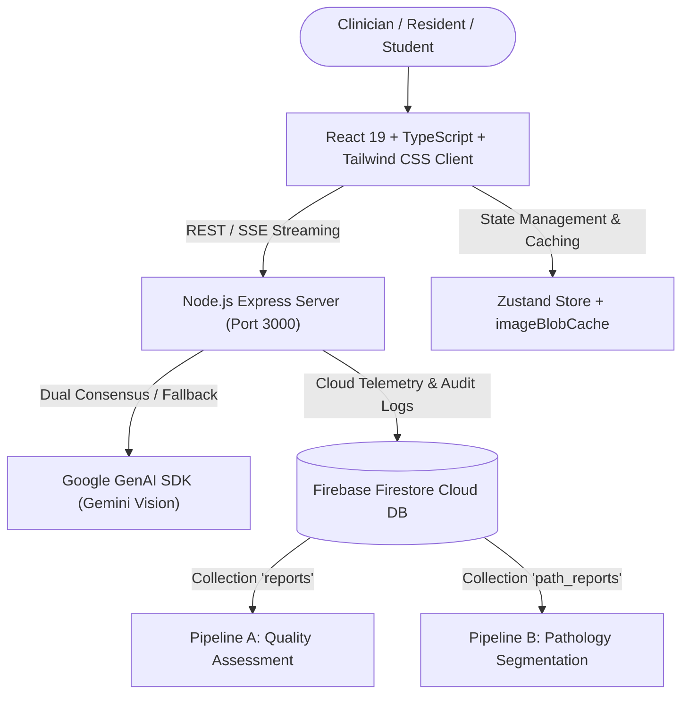

# 🦷 PeriApicaI — Next-Gen Multimodal AI Imaging Platform for Dental Radiology

> **Web Application powered by Google Gemini.**
>
> 🚀 *Official Entry for **Vietnam AI Riser 2026** — Medical AI & Healthcare Transformation Category.*

---

## 📌 Application Overview

**PeriApicaI** is an advanced AI-powered web platform designed for dental practitioners, radiologists, residents, and students. By combining **Google Gemini Vision multimodal AI models**, real-time **Server-Sent Events (SSE) streaming**, and **2D spatial grounding**, PeriApicaI delivers instant, highly accurate diagnostic assistance for intraoral dental radiographs (periapical and bitewing X-rays).

The platform addresses two critical diagnostic challenges in clinical dentistry:
1. **Technical Radiography Quality Control**: Identifying exposure, positioning, and processing errors to prevent diagnostic misinterpretation and reduce unneeded patient re-exposure.
2. **Pathology Grounding & Segmentation**: Precise 2D polygon segmentation of dental pathologies, anatomical structures, and existing restorations.

---

## 🌟 Core Features & Capabilities

- **Dual-Pipeline Diagnostic Engine**:
  - **Pipeline A (Technical Quality Assessment)**: Evaluates 12 technical exposure and positioning error categories, providing 4 quantitative CAD metrics (periapical bone gap, occlusal plane tilt, crown/root ratio, proximal overlap).
  - **Pipeline B (Pathology 2D Segmentation)**: Detects and segments 8 anatomical and pathological structures using normalized $[0, 1000]$ spatial grounding coordinates.
- **Dual-Model Consensus Engine**:
  - Runs parallel inference across Gemini models (`gemini-flash-latest`, `gemini-pro-latest`, `gemini-flash-lite-latest`) with automatic retry and quota-exhaustion fallback logic to maximize diagnostic accuracy.
- **Interactive Vertex Polygon Canvas**:
  - Interactive SVG overlay canvas with editable vertex anchors allowing clinicians to adjust, fine-tune, or add custom pathology contours in real time.
- **OffscreenCanvas Image Processing**:
  - Web Worker-offloaded image decoding and adaptive multi-stage compression to optimize ultra-high-resolution X-rays (4K/8K) for AI inference without sacrificing fine diagnostic details.
- **4-Domain Theme Architecture**:
  - Purpose-built visual hierarchy with distinct color themes for Header Navigation, Technical Quality (Royal Blue), Pathology Grounding (Deep Ocean Teal), and Admin Telemetry (Metallic Slate).
- **Admin Audit & Telemetry Portal**:
  - Firebase Firestore-backed audit management portal featuring live report synchronization, clinical verification tools, bug report tracking, and report exports (CSV/JSON).

---

## 🏛️ System Architecture

---

## 🛠️ Technology Stack

- **Frontend**: React 19, Vite 6, TypeScript 5, Tailwind CSS v4, Zustand 5, Motion, Lucide Icons, react-i18next (VI / EN).
- **Backend**: Express.js with SSE streaming, compression, rate-limiting, and security headers.
- **AI Integration**: `@google/genai` TypeScript SDK with Structured JSON Schemas.
- **Database**: Firebase Firestore real-time cloud database.
- **Deployment**: Google Cloud Run / Containerized Node.js environment.

---

## 📜 Version Logs & History

For complete release notes, version history, and detailed feature logs, please refer to:
👉 **[version_logs.md](./version_logs.md)**

---

- **Author**: NBTrung, MD, MSc
- **Version**: v2.6.0
- **License**: Proprietary / Educational & Clinical Research
