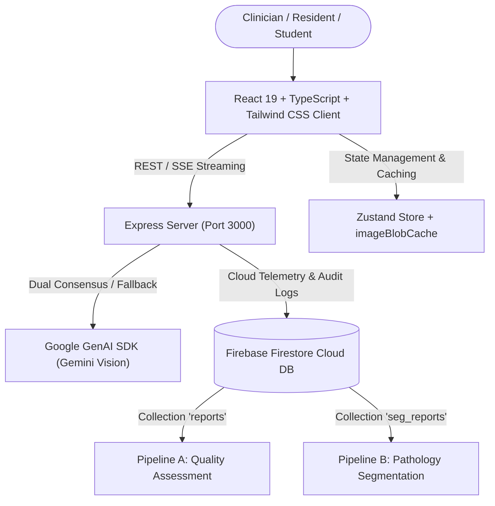

# 🦷 PeriApicaI — Multimodal AI Imaging Platform Trial for Dental Radiology

> **Web Application Trial powered by Google Gemini on Google AI Studio.**

---

## 📌 Application Overview

**PeriApicaI** is an AI-assisted trial platform for dental radiology support. Powered by **Google Gemini Vision multimodal AI models**, PeriApicaI provides dual-pipeline assistance for intraoral dental radiographs (periapical and bitewing X-rays):

1. **Technical Radiography Quality Control**: Identifying exposure, positioning, and processing errors.
2. **Pathology Grounding & Segmentation**: 2D polygon segmentation of dental pathologies, anatomical structures, and restorations.

> *Note on Clinical Accuracy: Diagnostic outputs are AI recommendations for trial and educational purposes. Clinical benchmarks must be performed before any diagnostic reliance.*

---

## 🌟 Core Features & Capabilities

- **Dual-Pipeline Diagnostic Engine**:
  - **Classic Pipeline (`/api/analyze-radiograph`)**: Technical quality and CAD metrics assessment stored in `reports`.
  - **Pathology Pipeline (`/api/segment-pathology`)**: 2D spatial polygon grounding and pathology analysis stored in `seg_reports`.
- **Dual-Model Consensus Engine**:
  - Parallel inference across configured Gemini models with attempt budget limits and quota fallback.
- **Privacy-First Temporary Image Storage**:
  - Radiograph images are saved temporarily with short-lived HMAC signed URLs only when user explicit consent (`shareConsent: true`) is provided. If consent is declined, raw images and base64 payloads are cleared immediately and never saved to disk or database.
- **Interactive Polygon Canvas**:
  - Interactive SVG overlay canvas with editable vertex anchors for path adjustment.
- **Admin Portal**:
  - Audit management portal featuring report synchronization, clinical verification tools, and secure signed image access.

---

## 🏛️ System Architecture

---

## 🛠️ Technology Stack

- **Frontend**: React 18+, Vite, TypeScript, Tailwind CSS, Zustand, Motion, Lucide Icons, react-i18next (VI / EN).
- **Backend**: Express.js with SSE streaming, compression, rate-limiting, and security headers.
- **AI Integration**: `@google/genai` TypeScript SDK with Structured JSON Schemas.
- **Database**: Firebase Firestore (or Local JSON Fallback Cache).

---

## 📜 Version Logs & History

- **Author**: NBTrung, MD, MSc
- **Version**: v2.8.9
- **Environment**: Google AI Studio Trial Platform

